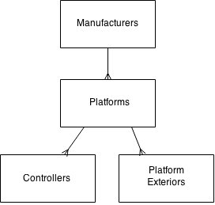

# Relational Data (Under cosntruction)

This article will help you understand relational data modeling. From the mathematical underpinnings, to an entity relationship (ER) diagram, the goal here is to provide you with a survey of important knolwedge that will illuminate the work you do every day with data.

In addition, being familiar with the terminology and background of relational data modeling can make you a stronger job candidate, as hiring managers appreciate someone who has taken the time to understand the "Why?" behind our every day technology.

## What is data?

Data is readible information. It can come in the form of numbers, characters, images or other things recorded to a durable medium. Data by itself is likely to be meaningless. Take the **data element** "M". By itself, we can say a few things about "M". It's a string. It's one character. In our table of data, we might say that "M" stands in a place that cannot be left ```NULL```. Still, we haven't learned anything.

For data to be useful, we need to interpret it. Suppose "M" is the value a user inputted in a form, meaning male gender. Now, we can make decisions or create business logic that deals with it. It has become information. The purpose for which we are writing software can be fulfilled, when data can be interpreted. We might want to match male users to clothing fit for males. We might want to use fitness metrics to determine ideal heart rate for male users.

As professionals dealing with data, our data needs to be as simple and reusable as possible. That's how we isolate meaning and build relationships that support the creation of new information. If we can easily compare gender with average time spent on the site, for example, maybe we can learn new information about our target audience. It's important for us to organize data to provide us with the best means for dealing with the information we need.

We will learn more about data in this article, spelling out the thinking that underlies well organized data in greater detail. That way, we can unlock the potential benefits that well-modeled data has to offer software developers.

## What is a data model?

There are a few different types of data models. And the ones I will introduce here are related in that one is the basis for the next. Starting with a **conceptual** data model: this abstracts away detail to focus at the highest level of analysis. The example below demonstrates a conceptual model. For now, don't let the specific graphics distract you. Get a general sense of the relationship being illustrated.

### Note: Guiding Example

For the purpose of this article, we will be dealing with a certain type of data with established relevance: game consoles! If you suppose we are building the back end for a game console sales business, we need to think about what data model captures the information the business will need.



Conceptual data models are made up of conceptual entities--the models are never going to be physically deployed as illustrated. They don't have attributes. Rather, they are mainly used as a tool for developers to better understand the needs of a business or the purpose software needs to fulfill.

In this case, let's look at one example that serves this conceptual model. A manufacturer like [Sony](http://en.wikipedia.org/wiki/Sony) can produce a [PlayStation 1](http://en.wikipedia.org/wiki/PlayStation_%28console%29), and it has (among others) the legendary [DualShock 1](http://en.wikipedia.org/wiki/DualShock) controller. And the PlayStation 1 comes in the re-designed [PSone](http://en.wikipedia.org/wiki/PlayStation_models#PSone) exterior, as well as the original, boxy exterior.

A conceptual data model is used to inform a **logical** model. A logical data model includes details that a conceptual model leaves out. All of a logical entity's attributes need to be fully spelled out. That means we need to completely understand the business details. Make note that with conceptual and logical models, we are learning more about the business to understand the needs of the data model. Logical models come closer to implementation, but they are still used in this learning phase.

Suppose we have a very clear idea of what information is important to our console sales business. That's the kind of confidence we need to create a logical model--we need to have all of the business details established.

[Example]

These preliminary data models lead to the **physical** data model. This is the model that will determine the actual design of a database. With this data model, we have to consider database performance, scale, our software, legacy data, and more.

[Example]

The three types of modeling above, if done in succession, are meant to provide the basis of real implementation. However, we haven't considered the current state of affairs. Sometimes, we already have a business, software and data to study. That can form the basis of an **as-is** data model. Sometimes, we are charged to invent or re-invent a data model: which is called a **to-be** data model.

Having a grasp of these different data modeling states can enrich how you deal with and communicate about data models. Are you trying to come up with an as-is data model, at the conceptual level, for practice? Or, do you need a logical, to-be model ready to go by Monday morning for the development team to start implementing?

## Why relational data modeling?

Heirarchy, network, relational

properties of relational databases - (pg 30)

primary key, foreign key, migrating

objectives (pg 35) and advantages (pg 39) of relational data modeling

selected rules of the 12 rules of relational data management - (pg 36 - 39)

## How does it work? Math!

requires some basic knowledge of set notation

watershed article - E.F. Codd's relational model of data in 1970 while at IBM

Five primitive operators of Codd's algebra are:
+ the selection
+ the projection
+ the Cartesian product (also called the cross product or cross join)
+ the set union
+ the set difference

Renames

Joins
+ Natural join (⋈)
+ θ-join and equijoin
+ Semijoin (⋉)(⋊)
+ Antijoin (▷)
+ Division (÷)

More joins
+ Outer joins
+ Left outer join (⟕)
+ Right outer join (⟖)
+ Full outer join (⟗)

## Painting the rest of the picture

normalization

entities

attributes

normal forms - (pg 40-53)

universal relations - (pg 41, 43)

## In practice

### Buzz words

pg 57

### Buzz graphics

pg 89

IE 101

## OO Modeling
